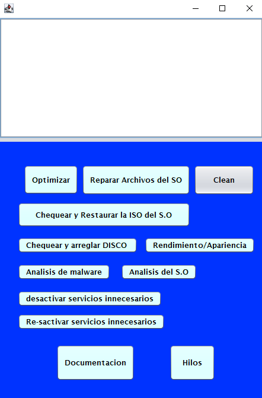

Importante ejecutar como Administrador!!

# BarkoManager o Administrar y optimizar el rendimiento en Windows
Aplicacion desktop para administrar y mejorar el rendimiento en Windows 10 y Windows 11. 

La **concurrencia** en este código se logra a través del uso de **SwingWorker**, que permite ejecutar tareas en segundo plano en un hilo separado, de esta manera se logra que en tiempo real se obtenga la informacion en pantalla de lo que está arrojando el **CMD** y no tener que esperar hasta el final. Hay dos métodos principales que se sobrescriben en SwingWorker:

**doInBackground()**: Este método se ejecuta en un hilo separado y es donde se realiza la tarea en segundo plano. En este caso, la tarea es ejecutar un comando del sistema operativo y leer su salida.

**process()**: Este método se ejecuta en el hilo de despacho de eventos de Swing y se utiliza para actualizar la interfaz gráfica de usuario con los resultados de la tarea en segundo plano. En este caso, se utiliza para agregar la salida del comando a un área de texto.

# Ejemplo sencillo (GUI) para explicar la concurrencia en Java
Este proyecto incluye un ejemplo sencillo de cómo implementar concurrencia en Java utilizando hilos (threads) y mecanismos de sincronización. El objetivo es simular el funcionamiento de un restaurante de manera grafica.

# Funcionamiento del programa

1. **Inicio de la aplicación**: Cuando se inicia la aplicación, se crea una instancia de `Restaurante` y se llama al método `iniciar()`. Este método inicia los hilos `Mesero` y agrega los `Cliente` a la cola.

2. **Atención de los clientes**: Cada hilo `Mesero` intenta obtener un `Cliente` de la cola. Si la cola está vacía, el hilo `Mesero` espera hasta que haya un `Cliente` disponible. Una vez que un `Mesero` obtiene un `Cliente`, lo atiende. La atención del cliente implica mover al `Mesero` a la ubicación del `Cliente`, esperar un tiempo aleatorio para simular la atención, y luego mover al `Mesero` de vuelta a su posición original.

3. **Interfaz gráfica de usuario**: La interfaz gráfica de usuario muestra a los `Cliente` y a los `Mesero`. Cuando un `Cliente` es atendido, se elimina de la interfaz gráfica de usuario. Cuando todos los `Cliente` han sido atendidos, se muestra un mensaje y se interrumpen los hilos `Mesero`.

4. **Interrupción de los hilos**: Los hilos Mesero pueden ser interrumpidos de dos maneras. Una forma es cuando el numero de Clientes sobrepasa el limite de atendidos (1000). La otra forma es cuando se pulsa el botón de detener. Cuando un hilo Mesero es interrumpido, deja de atender a los Cliente y cambia su estado a interrumpido, después de un poco, termina su ejecución.
5. **Detener los meseros**: Cuando se pulsa el botón de detener, se interrumpen todos los hilos Mesero y se cierra la interfaz gráfica de usuario del restaurante.

# Uso de la concurrencia
1. **Hilos**: En Java, la concurrencia se logra a través del uso de hilos. Un hilo es una unidad de ejecución dentro de un proceso. En este código, cada `Mesero` se ejecuta en su propio hilo. Esto permite que varios `Mesero` atiendan a los `Cliente` al mismo tiempo, al igual que en un restaurante real.

2. **Sincronización**: La sincronización es un aspecto importante de la programación concurrente. En este código, se utiliza un objeto de bloqueo (`lock`) para asegurar que sólo un hilo `Mesero` pueda acceder a la cola de `Cliente` en un momento dado. Esto evita las **condiciones de carrera**, que pueden ocurrir cuando dos o más hilos intentan modificar una variable compartida al mismo tiempo.

3. **Comunicación entre hilos**: Los hilos `Mesero` y `Cliente` se comunican entre sí a través de la cola de `Cliente`. Cuando un `Cliente` es atendido, se elimina de la cola. Si la cola está vacía, los hilos `Mesero` esperan hasta que haya un `Cliente` disponible.

4. **Interrupción de hilos**: Los hilos `Mesero` pueden ser interrumpidos, lo que les permite terminar su ejecución antes de tiempo. Esto se utiliza en este código para detener a los `Mesero` una vez que todos los `Cliente` han sido atendidos, o cuando se pulsa el botón de detener.

5. **Espera activa**: La espera activa se utiliza en este código para simular el tiempo que tarda un `Mesero` en atender a un `Cliente`. Esto se logra haciendo que el hilo `Mesero` duerma durante un tiempo aleatorio.

# Autor ✒️
Brayan Barco
# Licencia 📄
Este proyecto está licenciado bajo la Apache License 2.0 - ver el archivo [LICENCIA](https://github.com/Barcodehub/BarkoManager/blob/main/LICENSE) para más detalles.
